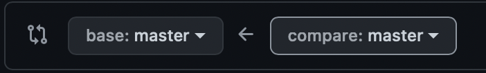

> 210604 K-Digital DS/DA Github 특강 - 오창희 강사님 


  

## Commit message Convention

**★ 커밋 메세지는 회사마다, 팀마다, 사람마다 달라질 수 있음!!!!!!!!**

  

### 1. Commit message 작성 규칙

기본적으로 커밋 메시지는 아래와 같이 제목 / 본문 / 꼬리말로 구성한다.

```
type : subject

body

footer
```

차이가 무엇이고 수정 이유를 log로 남길 수 있다.  

뼈대 코드 구성, 메인 기능 구현, 로그인 기능 구현, 채팅 기능 구현, 디자인 적용 등   


### 2. Subject (제목)

제목은 50자를 넘기지 않으며, 대문자로 시작하고 마침표를 붙이지 않는다.  

과거 시제를 사용하지 않고 명령어로 작성한다.  

#### ☑️ Commit Type

* feat : 새로운 기능 추가
* fix : 버그 수정
* docs : 문서 내용 변경
* style : 포맷, 세미콜론 수정 등 코드가 아닌 스타일에 관련한 수정
* refactor : 코드 리펙토링
* test : 테스트 코드 추가 및 리펙토링 테스트 등
* chore : build task 수정, 프로젝트 매니저 설정 수정 등


### 3. Body (본문)

선택사항이기 때문에 모든 커밋에 본문 내용을 작성할 필요는 없다.  

부연설명이 필요하거나 커밋의 이유를 설명할 경우 작성한다.  

72글자를 넘기지 않고 제곰고가 구분되기 위해 한칸을 띄워 작성한다.  


### 4. Footer (마무리)

선택사항이기 때문에 모든 커밋에 꼬리말을 작성할 필요는 없다.  

issue tracker id를 작성할 때 사용한다.  


### 여러 줄의 커밋 메시지 작성 방법

`"`  로 시작해 엔터를 눌러 여러 줄의 메세지를 작성한다. 다음 `"`가 나오기 전까지 엔터를 눌러도 명령어로 인식하지 않는다.  

작성 예시

```
git commit -m "Docs : 혼자 공부하는 파이썬 Chapter 4-1
리스트와 반복문
Issues : #50
"
```

```
git 커밋 메시지 : 날짜 | 수정내용

예) 210604 | y.txt. upload
```

  

___

  

## PEP8 스타일 가이드

파이썬에서 읽기 쉬운 코드를 작성하는 방법을 알려준다.  

이번은 git에 대한 내용이므로 다음에  PEP8에 대한 내용만 따로 정리하려고 한다.

  

___

  

## .gitignore

이곳에 넣는 파일들은 git으로 관리하지 않는다!

중요한 정보를 가진 파일들 또는 자동으로 생성되는 파일들을 .gitignore로 관리한다.  

삭제하고 싶은 것을 .gitignore 파일 안에 작성한다.  

* **파일 이름 무시** : 파일이름.* (해당 파일이름을 가진 확장자를 인식하지 않겠다.)  

  예) test.* : test.text 와 test.md 파일 모두 인식 X

- **폴더 이름 무시** : 폴더이름/ (해당 폴더 하위 정보를 인식하지 않겠다.)  

  예)  test/ : test 폴더 내 모두 무시

    

### ☑️ 사이트를 이용하는 방법

[Gitignore.io](http://Gitignore.io) (https://www.toptal.com/developers/gitignore)

사이트에 접속해서 사용하는 언어를 작성하면 자동으로 gitignore 데이터를 만들어줌

windows, macOS, JupyterNotebooks, Python, VisualStudioCode, VisualStudio, PyCharm,  Java 등

  

___

  

## Marge branch

git에서도 작성하고 vsc에서도 작성하면 코드가 꼬여서 업로드가 안됨 그래서 pull로 순서를 정해줘야함

git애서 z.txt 파일을 생성하고 vsc에서 y.txt를 생성 후 push 를 하게되면 오류 발생!!

(git 에서 파일 생성하는 법 : 폴더 접속 후 오른쪽 상단 add file 클릭 -> create new file 클릭)

github에 있는 z파일을 들고 오기 위해 `git pull origin master` 을 사용한다.  

​    	

### ☑️ 코드

​	1) `git add y.txt`

​	2)  `git commit -m "210604 | “y.txt upload”`

​	3) `git pull origin master`

​	4) `git push origin master`

  

___

  

## 클론(clone)

>  원격 저장소에 있는 코드를 그대로 가져오는 것

  

### 원격 저장소에 있는 클론 가져오기

1. my-pjt 폴더 내 초록색 code▾ 를 클릭

2. 클론 주소를 복사!

3. 터미널에 들어가서 데스크탑에 아래 코드를 입력한다.

   ```bash
   git clone https://github.com/lasso-jiwon/my-pjt.git
   ```

4. 데스크탑에 my-pjt 폴더가 생긴다
5. my-pjt를 다시 비주얼스튜디오 코드에 불러온다.

   

>  비주얼 스튜디오 코드가 집용(github), 데스크탑에 저장한 강의장용(my-pjt) 두개가 띄워져 있어야 한다.

  

1. 집에서 리드미를 수정한다. 집용(github)에 아래 코드를 입력한다.

   `git add .`

   `git commit -m "210604 | README 수정"`

   `git push origin master`

2. 깃헙에서 리드미가 수정 완료되었는지 확인한다.

3. 강의장에서 리드미를 불러옵니다. 데스크탑에 저장한 강의장용(my-pjt)에 아래 코드를 입력한다.

   `git pull origin master`

  

___

  

## 코드 정리


1. \*`git init` : 로컬 깃 생성됨. 
2. \*`git remote add origin <git url>` : 원격 저장소 등록 (클론 주소와 동일)
3. `git add` : 추가합니다.
4. `git commit -m "<commit>"` : 커밋을 남깁니다.
5. `git pull origin master` : 데이터를 가져옴, 깃허브의 마스터 브랜치를 동기화
6. `git push origin master` : 데이터를 보냄
7. \*`git clone 폴더 주소` : 원격 저장소 복제

\* 은 최초에 한번만 실행함!

  

___

  

## 에러 발생 상황

>  집에서도 강의장에서도 동시에 코드를 수정했을 경우!

  

1. 집 리드미 수정, 강의장 리드미 각각 수정

2. 집에서 코드 입력

```bash
git add .
git commit -m "210604 | 집에서 수정"
git push origin master
```

3. 강의장에서 코드 입력 (오류 발생!!)

```bash
git add .
git commit -m "210604 | 강의장에서 수정"
git push origin master  # 오류 발생
```

4. 강의장에서 코드 입력

```bash
git pull origin master   # pull로 동기화 해준다
git log  # marge 라는 커밋이 하나 쌓인다
git push origin master
```

5. 집에서 코드 입력

```bash
git pull origin master 
```

  

___

  

## 커밋 수정 방법

>  직전 코드 1개만 수정할 수 있다.  

  

1. `git commit --amend` 를 입력한다.

2. 키보드 `i`  를 누르면 '끼워넣기' 글자가 생기면서 수정모드가 된다.
3. 수정모드에서 커밋을 수정한다.
4. `Esc` 를 눌러서 수정모드를 빠져나온다.
5.  `:wq` (저장하고 종료하기)를 쓰고 엔터를 누른다.
6. `git log` 를 눌러서 수정된 커밋을 확인할 수 있다.

  

:wq 는 vim에서 쓰이는 코드인데  

vim 단축키 모음을 외워야 하는데... 이를 쉽게  배우는 사이트는 아래로 확인하자

* 게임으로 알려주는 사이트 : https://vim-adventures.com
* 빔 튜토리얼 사이트 : https://www.openvim.com

  

___

  

## add 했던 파일 다시 내리는 방법

1.txt 파일과 2.txt 파일을 만들고 `git add .` 을 해버렸어...!

근데 1 파일과 2 파일 따로 커밋을 해야할거 같으면?

1. `git statues` 로 확인하기

   ``` bash
       new file:   1.txt
       new file:   2.txt
       new file:   asdf.txt
   ```

2. `git restore --staged <file name>` 내리고 싶은 파일 이름을 입력한다.

   예) git restore --staged 2.txt

3. `git status` 다시 확인

   ```bash
       new file:   1.txt
       new file:   asdf.txt
   ```

  

___

  

## github로 협업하기

바탕화면에 end-to-end 폴더 생성  

Vac 로 불러오기  

팀원 초대하기

1. settings  
2. manage access  

  

초대장을 받은 팀원은 깃허브에 연동된 계정의 메일에 들어가서 확인하기  

클론 뜨기 (오른쪽 초록색 code 의 clone 주소 복사)  

바탕화면 git bash here을 눌러서 창이 뜨면  

git clone <주소>  

바탕화면에 end-to-end 폴더가 생김!!!  

폴더에 들어가서 vsc 코드로 열기 누르면 됨!  

  

___

  

## branch

1. `git branch` : 브랜치 뭐있나 알아보기

2. `git branch jiwon` 'jiwon'이라는 이름의 브랜치 생성하기

   master과는 전혀 상관없는 jiwon 평행세계가 만들어짐

3. bash-3.2$ `git branch` 해보면 방금 생성한 jiwon 확인 가능
   
     ```bash 
   jiwon
     
     * master
   ```
   
4. `git switch jiwon` 방금 만든 jiwon 브랜치로 이동하기

5. `git swith master` 하면 다시 마스터로 돌아옴  

     jiwon 에서 변경을 하고 저장하지 않고 master로 이동하려고 할 때 오류가 남!  

     이럴 때는 변경 사항을 지워주거나 `git add .`  , ` git commit` 다시 해줘야함  

6. `git push origin jiwon`

  

### 브랜치로 만든것을 master로 합치기

1. 상단 메뉴 3번째 탭에 있는 Pull requests 를 누른다.

2. 오른쪽 초록색 New pull request 버튼을 누른다.

3. base : master <- compare : jiwon (jiwon에서 master으로 합친다.)

   

4. 오른쪽 초록색 Create pull request 버튼 누르기
5. 제목과 내용을 작성해서 병합 요청하기
6. 팀의 리더가 확인 후 Merge pull request 함

  

### 만든 브랜치 삭제하기

1. 로컬에서 삭제하기 :  `git branch -d jiwon`
2. 깃허브에서 삭제하기 : master▾  버튼 누르고 view all branches 누르면 전제 목록을 볼 수 있음! 여기서 삭제 가능

  

___

​    

## 다른 사람 코드에 제안하기, 직접 수정하기

#### 1. Issues (제안하기)

제안을 하고 싶은 다른 사람 코드 화면에서 Issues 버튼을 누르면 글을 쓸 수 있다.  

  

#### 2. Fork - Clone (직접 수정하기)

1. fork 버튼을 누르면 다른사람의 프로젝트를 내 깃허브에 그대로 가져온다.  

   change/project -> jiwon/project

2. 내 깃허브에 있는 코드를 클론한다.  (터미널 바탕화면에서)

   바탕화면에 project 폴더가 생기고 수정할 수 있게 된다.

3. 수정 후 add-commit-push  하면 내 깃허브에 있는 코드가 수정된다.

4. jiwon/project 에서 Pull requests - New pull request 누른다.

   base repository : change/project | base master <- head repository jiwon/project | compare master

5. Create pull request 를 눌러 요청을 보낸다!

  

## git 최종 정리하기

빨간색은 무조건 알아야 하는 것!!!!!!


  

## 깃을 할 때 알아야 할 소소한 팁

- gitlog 에서 나가는 방법 : `:q` 
- 취소하는법  : `ctrl + c`
- 코드 올리는 법 : `ctrl : l`

